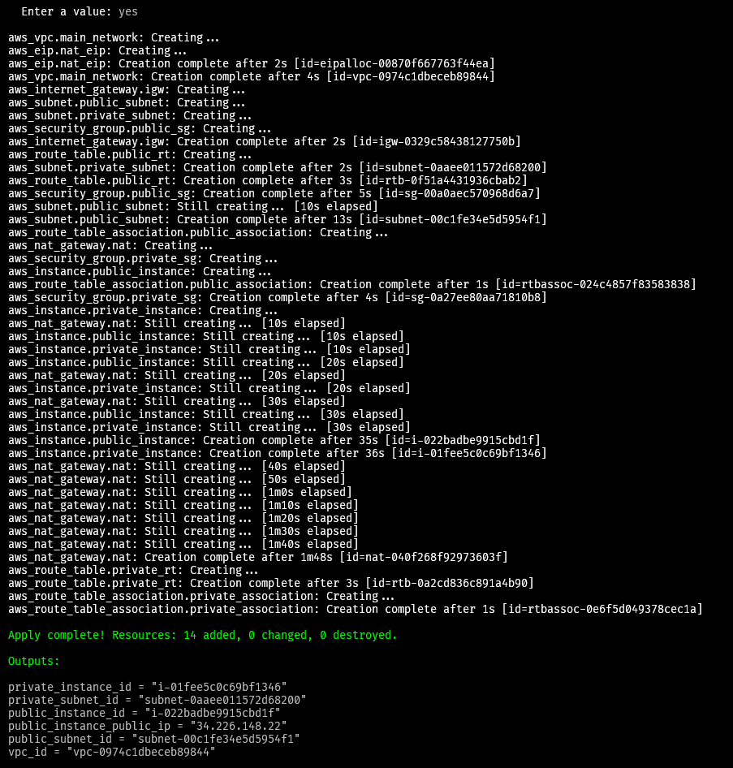
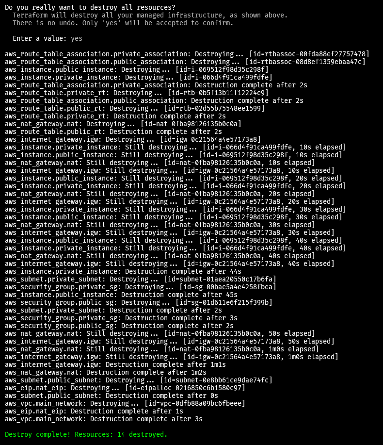

# Basic Infrastructure Creation with Terraform

This Terraform configuration sets up a basic infrastructure on AWS, which includes a Virtual Private Cloud (VPC) and related networking components. It creates both public and private subnets and provisions two EC2 instances: one in the public subnet and one in the private subnet.

## Features

- **VPC**: A Virtual Private Cloud to host all your resources.
- **Public Subnet**: A subnet with a route to the internet.
- **Private Subnet**: A subnet without direct access to the internet.
- **Internet Gateway**: Allows access to the internet for instances in the public subnet.
- **NAT Gateway**: Allows instances in the private subnet to access the internet.
- **Route Tables**: Configured for both public and private subnets.
- **Security Groups**: Manage inbound and outbound traffic for the instances.
- **Elastic IP**: For the NAT Gateway.
- **EC2 Instances**: Two EC2 instances, one in the public subnet (with Nginx installed) and one in the private subnet.

## Network Diagram


## Resources Created

1. **VPC**
   - CIDR Block: `10.0.0.0/16`
   - Name: `main_network`

2. **Public Subnet**
   - CIDR Block: `10.0.1.0/24`
   - Name: `public_subnet`
   - Public IP on launch: Yes

3. **Private Subnet**
   - CIDR Block: `10.0.2.0/24`
   - Name: `private_subnet`
   - Public IP on launch: No

4. **Internet Gateway**
   - Attached to the VPC
   - Name: `main_network_igw`

5. **NAT Gateway**
   - Elastic IP assigned
   - Located in the public subnet
   - Name: `main_network_nat`

6. **Route Tables**
   - Public Route Table with a route to the Internet Gateway
   - Private Route Table with a route to the NAT Gateway

7. **Security Groups**
   - `public_sg`: Allows HTTP (port 80) and HTTPS (port 443) inbound traffic
   - `private_sg`: Allows SSH (port 22) traffic from the public subnet

8. **EC2 Instances**
   - **Public Instance**
     - AMI: Latest Ubuntu AMI
     - Instance Type: `t2.micro`
     - Security Group: `public_sg`
     - Subnet: `public_subnet`
     - Key Name: `my_public_key`
     - User Data: Installs and starts Nginx
   - **Private Instance**
     - AMI: Latest Ubuntu AMI
     - Instance Type: `t2.micro`
     - Security Group: `private_sg`
     - Subnet: `private_subnet`

## Outputs

- **vpc_id**: ID of the main VPC
- **public_subnet_id**: ID of the public subnet
- **private_subnet_id**: ID of the private subnet
- **public_instance_id**: ID of the public EC2 instance
- **private_instance_id**: ID of the private EC2 instance
- **public_instance_public_ip**: Public IP address of the public EC2 instance

## Usage

To apply this Terraform configuration, follow these steps:

1. Ensure you have [Terraform](https://www.terraform.io/downloads.html) installed.
2. Configure your AWS credentials.
3. Save the Terraform configuration into a file (e.g., `main.tf`).
4. Initialize the Terraform workspace:
    ```sh
    terraform init
    ```
5. Apply the Terraform configuration:
    ```sh
    terraform apply
    ```

This will create all the resources as described above and output the IDs and public IP of the created instances.

### Terraform Commands
- `terraform init`
- `terraform plan`
- `terraform apply`
- `terraform destroy`

### EC2 Notes

```sh
Amazon Linux 2023 AMI 2023.3. ami-0d7a109bf30624c99
Amazon Linux old ami-007868005aea67c54
Ubuntu 22.04 AMI ami-080e1f13689e07408
```

### Terraform EC2 Recreate Issue

If Terraform tries to recreate EC2 instances without any changes, refer to [this GitHub issue](https://github.com/hashicorp/terraform-provider-aws/issues/1041). A common solution is to use `vpc_security_group_ids` instead of `security_group` for VPC security groups.

### Installing Nginx on Public Instance

```sh
sudo apt update
sudo apt install nginx
sudo systemctl restart nginx
sudo systemctl enable nginx
sudo systemctl start nginx
```

### Terraform Apply Result



### Terraform Destroy Result



### Generating Terraform Diagram

To generate a visual representation of your Terraform plan:

```sh
terraform graph -type=plan | dot -Tpng >graph.png
```
or

https://spacelift.io/blog/terraform-graph  


generatge graph.dot values using the belwo comand

```sh
terraform graph > graph.dot
```
then generate image from https://dreampuf.github.io/GraphvizOnline